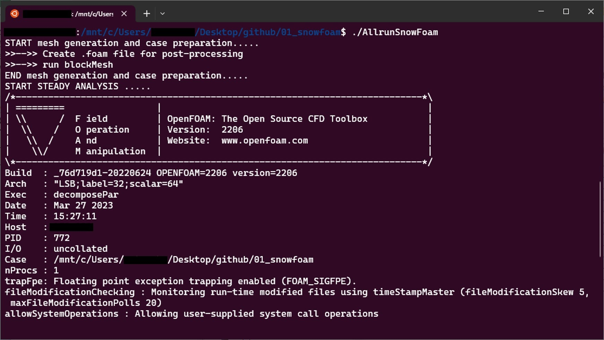
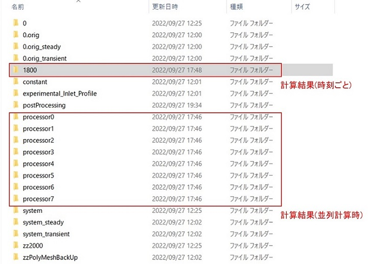

# FY2022 PLATAEU-UC22-027「雪害対策支援ツール」の成果物

## 1.概要
3D都市モデルを利用した街区レベルでの風雪・融雪シミュレーションを行うためのOpenFOAMのソルバーです。
本リポジトリでは、開発したソルバー「SnowFoam」及び「SnowMelt」のスクリプトとその使用方法を提供しています。 

## 2.「雪害対策支援ツール」について
### ユースケースの概要
本業務では、豪雪地帯における戦略的な雪害対策の立案を支援するため、雪害リスクを街区レベルで可視化し、建屋リスク（屋根雪による倒壊、落雪等）や除雪困難エリアの出現による孤立リスクの把握等を可能とする風雪・融雪のシミュレーションの開発を行いました。

### 開発システムの概要
「SnowFoam」及び「SnowMelt」は、オープンソースのCFD解析ソフトウェアである OpenFOAM のソルバーであり、3D都市モデルを組み合わせることで街区レベルで吹き溜まりや日陰部分の残雪等の詳細な解析を可能とするものです。  
「SnowFoam」及び「SnowMelt」は、OpenFOAMの標準ソルバーである「rhoPimpleFoam」（非定常の圧縮性乱流解析ソルバー）及び「thermoFoam」（凍結した流れ場での熱輸送解析ソルバー）の2つカスタマイズすることで開発しています。
カスタマイズは、新潟工科大学富永教授が開発した3次元気流解析に基づく雪の浸食・堆積と、雪面熱収支に基づく融雪の推定モデルを表現できるように行いました。  

シミュレーション条件として、3D都市モデルの地形・地物データをSTL形式としてインプットし、境界条件として、気象関連データ（時間毎の風向・風速、積雪、気温、日射量）を設定します。  
風雪シミュレーションでは、風速分布を流れ場の解析から求めます。これに対して、雪の飛雪量と積雪量の計算を行います。また、融雪解析では、日照、気温等の雪面の熱収支に基づき融雪量の計算を行います。  
算出した風雪・融雪シミュレーション結果は、積雪重量分布データとしてCSV形式で出力することができます。

## 3.利用手順
本ユースケースで開発した「風雪・融雪シミュレーション」を行う手順は以下のとおりです。  
OpenFOAMの基本的な使用法、「SnowFoam」及び「SnowMelt」の解説、風雪・融雪シミュレーションの具体的な計算手順については、[「風雪・融雪シミュレーション計算手順マニュアル」]( https://matsuda-ts.github.io/PLATAEU-UC22-027-sim-windsnow-tool-Manual/)を参照ください。  
「SnowFoam」及び「SnowMelt」のテクニカルリファレンスは、「Wind and Snow Melting Simulation Using OpenFOAM Technical Reference.pdf」をダウンロードしてご覧ください。

1. OpenFOAMをインストール（ただしLinux環境でなければ、「風雪・融雪シミュレーション計算手順マニュアル」等に沿ってwindows上でLinux環境を構築する必要があります）  
2. 本リポジトリから「SnowFoam」及び「SnowMelt」をダウンロード  
3. OpenFOAMをダウンロードした際に構築されるケースディレクトリーにソルバーを移動  
4. 用意されているシェルスクリプトを実行（サンプルの計算メッシュを利用）  
5. 結果の評価にparaviewを利用（ParaViewをインストールしておいてください）  
※計算メッシュは、3D都市モデルがあれば「風雪・融雪シミュレーション計算手順マニュアル」等に記載のメッシュ作成方法で用意すれば、どこでも計算条件も変えて解析可能です。  

OpenFOAMは、Linux環境で動くオープンソフトの数値流体解析のツールボックスです。このためOpenFOAMの利用にあたっては、Linax環境に関する知識や数値流体力学に関する知識が必要になります。詳細は下記の参考資料に紹介している[説明サイト](https://ss1.xrea.com/penguinitis.g1.xrea.com/study/OpenFOAM/index.html)や[専門書](https://ja.wikipedia.org/wiki/OpenFOAM)を参照してください。  

### 動作環境  
OS　 Windows10　Pro　64-bit  
CPU　Intel(R) Core(TM) i9 3.50GHz  
GPU　NVIDIA GeForce RTX 3070  
Memory　64GB RAM  
ディストリビューション Ubuntu22.04  

### 事前準備
OpenFOAMのインストールについては[「風雪・融雪シミュレーション計算手順マニュアル」](https://matsuda-ts.github.io/PLATAEU-UC22-027-sim-windsnow-tool-Manual/)にも記載がありますが、詳細は、[こちら](https://ss1.xrea.com/penguinitis.g1.xrea.com/study/OpenFOAM/install_memo/install_memo.html)を参考にしてください。  
風雪・融雪計算に用いる地物モデルは、3D都市モデルの建築物LOD2、地形LOD1をFME Dsektopにより三角形のポリゴンの頂点座標と面の法線ベクトルで構成されたSTL形式のデータに変換して作成します。STLデータはParaViewで可視化できます。STL形式のデータからOpenFOAMのソルバーを使って計算メッシュを作成します。なお、本リポジトリ―ではサンプルのメッシュデータを用意してあります。


### OpenFOAMのカスタマイズコードの使用方法
#### １. カスタマイズコードのコンパイル

本リポジトリであるカスタマイズコード mySolver/sourceCode をダウンロードし、OpenFOAMのフォルダーに保存します（下図の赤枠以外のフォルダーはOpenFOAMをダウンロードしたら自動的に生成されるフォルダーです）。
 

 
なお、mySolverの中には、風雪シミュレーションの「snowFOAM」、融雪シミュレーションの「snowMelt」のソースのほかに、コンパイル用のシェルスクリプトが格納されています。


 
#### ２. シェル画面で、１．のフォルダーに移動し、初期化を行うため、「.//Allwclean」を実行

```
:/usr/lib/openfoam/openfoam2206$ cd mySolver/sourceCode/
:/usr/lib/openfoam/openfoam2206/mySolver/sourseCode$ ./Allwclean
```

#### ３. カスタマイズコードをコンパイルするため、「./Allwmake」を実行

```
:/usr/lib/openfoam/openfoam2206/mySolver/sourseCode$ ./Allwmake
```

なお、ソースコードを書き換えた場合、毎回手順２．３．を実行します。

### 風雪・融雪シミュレーションの使い方（実行）
#### １. プロジェクトフォルダーの作成
OpneFOAMでは一般的に、ソルバー毎に用意されているチュートリアルをコピーし、それをベースにしてプロジェクトフォルダーを作成します。  
本ユースケースでは、用いるソルバーに対してあらかじめ必要な情報をセットしたものを風雪シミュレーションのプロジェクトフォルダー（01_snowfoam、02_snowMelt）に用意してあります。これらををダウンロードし、作業する場所（例：desktop等）に保存してください。


#### ２. シェルスクリプトの実行
シェル画面で、１．のフォルダーに移動し、メッシュ作成やソルバー実行などのコマンドをまとめているシェルスクリプト（AllrunSnowFoam、AllrunSnowMelt）を実行します。

```
:/ubunts/プロジェクト名$ ./AllrunSnowFoam
```
※AllrunSnowFoam：並列計算や計算時間の設定、メッシュ作成、気流解析、風雪ソルバーの実施などが含まれたシェルスクリプトです。



```
:/ubunts/プロジェクト名$ ./AllrunSnowMelt
```
※AllrunSnowMelt：並列計算や計算時間の設定、気流解析、融雪ソルバーの実施などが含まれたシェルスクリプトです。


#### ３. 出力結果

計算結果（風速や積雪深など物性値毎のデータ）は、時刻フォルダーが生成され、時刻フォルダーにテキスト形式で保管されます。



## 4.ライセンス
* ソースコード及び関連ドキュメントの著作権は国土交通省に帰属します。
* 本ドキュメントはProject [PATAEUのサイトポリシー](https://www.mlit.go.jp/plateau/site-policy/)（CCBY4.0および政府標準利用規約2.0)に従い提供されています。

## 5.注意事項
* 処理時間は本環境におけるサンプルデータの場合、風雪が約2分、融雪が約6分×2ステップです。
* 本リポジトリは参考資料として提供しているものです。動作保証は行っておりません。
* 予告なく変更・削除する可能性があります。
* 本リポジトリの利用により生じた損失及び損害等について、国土交通省はいかなる責任を負わないものとします。

## 6.参考資料
* （近日公開）技術検証レポート: https://www.mlit.go.jp/plateau/libraries/technical-reports/
* PLATEAU Webサイト Use caseページ「雪害対策支援ツール」: https://www.mlit.go.jp/plateau/use-case/uc27-022/
* OpenFOAMの説明サイト：https://ss1.xrea.com/penguinitis.g1.xrea.com/study/OpenFOAM/index.html
* OpenFOAMに関する参考書：https://ja.wikipedia.org/wiki/OpenFOAM
